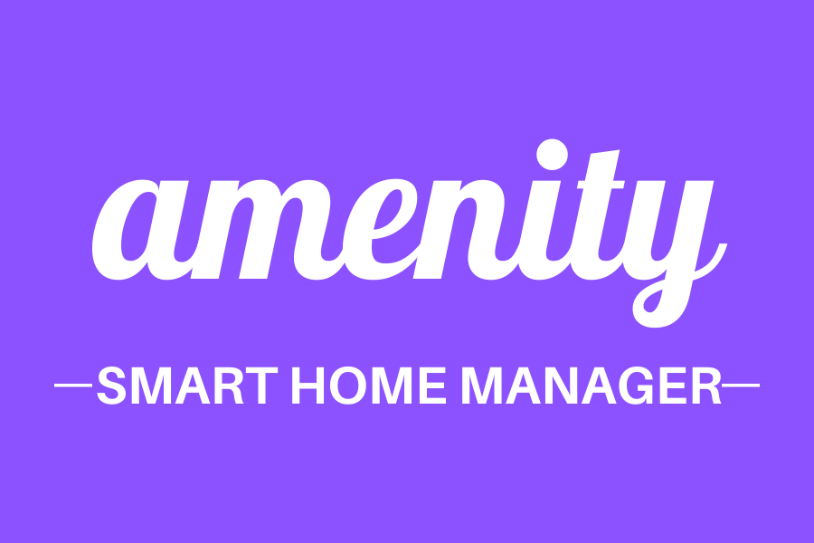

<h3 style="text-align: center">
    <a href=" https://sherylg343.github.io/smarthome/" target="_blank">
        
    </a>
</h3>

<h1 style="text-align: center">
Amenity, Smart House Manager Demo Site
</h1>

<div style="text-align: center">

[View website in GitHub Pages](https://sherylg343.github.io/smarthome/)
</div>

## Table of Contents <a name="table-of-contents"></a> 

1. [Project Purpose](#purpose)

2. [UX](#ux)

3. [Features](#features)

4. [Future_Goals](#future)

5. [Technology Used](#technology-used)

6. [Testing](#testing) - text in another document [TESTING](TESTING.md)

7. [Deployment](#deployment)

8. [Credits](#credits)

9. [Disclaimer](#disclaimer)

[Back to Top](#table-of-contents)


## Project Purpose <a name="purpose"></a> 
Amenity, Smart Home Manager, is a new technology company seeking to provide a
demonstration (Demo) website that will showcase their product's interactive 
controls and scheduling capabilities, without being connected to a set of home 
appliances and products. 

### Project Goals
Amenity's Demo control panel must provide a potential buyer with the opportunity 
to play with the function inputs and controls to gain an understanding of the 
scope of the product and how the controls interact with one another. The Scheduler 
section of the Demo will show how functions, for example lighting, can be turned 
on and off ahead of time, in the whole house or in a specific room. Amenity's 
goal for this Demo site is to have the user leave the Demo with a clear 
understanding of the basic functionality of the product and how this 
technology could work for them.

The business goal of the site is to move the potential customer further along 
through the sales funnel. While some customers may visit the site during the 
product research stage, the intent is to use the site to assist the customer 
in making a purchasing decision. Amenity wants the Demo site to help convince 
a potential client that their smart-home manager suits the customer's specific 
needs and resolves their relevant problems. The user should leave the site 
believing that this smart home manager would help them manage their home in 
an easy and convenient mannner.

### Target Audience
The target audience is defined as home owners looking for a fully-integrated 
smart-home manager, easily controlled through mobile devices. This website is 
not intended to sell the product, it is only to be used as a Demo of the core 
product. It's important that the user views, and has the opportunity to 
physically test, the types of controls that can be accessed remotely and see 
how scheduling is integrated into the system. The website will likely be used 
while working with a salesperson, either on the phone or in-person, so 
instructional directions are not required on the website. However, it is 
expected that the control elements will be intuitive to use.

<p>

[Back to Top](#Table-of-Contents)
</p>
---

## UX <a name="ux"></a>

### Targeted Demo Customers
* Own home - this product is specifically designed as a comprehensive home 
manager. For example, apartment residents with a few electronic appliances are 
not a target audience for this product.
* Currently possess or plan to purchase products and appliances for the home 
that are capable of being wirelessly controlled by a smart-home manager.
* Have explored Amenity's smart-home manager product and have enough interest in 
the product that they are willing to devote time to exploring the product's 
capabilities through a Demo.

### This Demo is being commissioned:
* to showcase Amenity's customized and integrated product in a succinct manner.
Amenity does not want to overwhelm potential clients, so the Demo should be a 
cross-section of the product's capabilities;
* to provide potential customers with the opportunity to try out the controls and 
functionality without having to first connect with their home products, as many 
other software packages require;
* to demonstrate the simplicity and intuitive design of the controls and scheduler.

### User Stories
1. As a homeowner with an existing "smart home," I want to change my system to one 
that integrates all my products and appliances capable of being controlled 
wirelessly. I am viewing the demo to determine if the following conditions of 
satisfaction are met:
* system supports a variety of controls and products;
* I am able to view all current settings for my home products and appliances 
electronically;
* I am able to make changes to settings in real time or schedule the changes in 
the future.
* I can easily access and make changes using an app on my phone.

2. As a homeowner, I have recently decided to purchase a smart house manager product 
that will electronically control available products and appliances within my home, 
for my convenience and ease of use. I am viewing the demo to determine if the following 
conditions of satisfaction are met:
* I need to try out the product and see how the controls work as I have not owned 
one of these products previously.
* controls and functions needs to be intuitive and integrated;
* I am able to view all current settings for my home products and appliances 
electronically;
* I am able to make changes to settings in real time or schedule the changes in 
the future.
* I can easily access and make changes using an app on my phone.

<p>

[Back to Top](#Table-of-Contents)
</p>
---


## Features <a name="features"></a>

### Use of Five Planes of UX in Project Design
#### Strategy Plane
An evaluation was conducted to determine which customer problems the Demo was being 
used to resolve. These customer needs are listed and reviewed in the 
[Strategy Trade-Off Analysis](README-assets/Amenity-strategy-trade-off.pdf).


#### Scope Plane
Below is a summary of the analysis done for this Demo site during the Scope Plane.
1. Objective: The user wants to accomplish manipulating the smart home controls to 
determine: ease of use, general capabilities of product, and answer question: will 
this do what I need it to do?
2. Functional: The user needs to physically see and manipulate the controls, see 
how they are integrated, and understand that controls can be scheduled as well as 
manipulated in real time.
3. Non-functional: The demo cannot easily connect to user's own appliances, so 
need to simulate the product being controlled. Security and scalability are 
not concerns at this time.
4. Business Rules: Human resources are limited at this time so need to produce a 
basic demo now that can be modified in the future.

#### Structure Plane
Below are the key considerations relative to the Structure Plane.
1. Consistency: 
* controls laid out in rows and move left to right
* one font used for headings and another used for body 
* one background, so focus is on the controls
2. Predictable:  
* similarly functioning controls look the same (e.g. on/off switches and range 
controllers)
* layout of each room box - controls are positioned in same order and location. 
e.g. Lighting is first, heating cooling is second and ceiling fans are third. 
On-off switches are to right of device name.
3. Learnable:
* Inputs/controls are disabled and faded out in when in "off" mode - easily 
recognizable as "off" to user.
* Fan and light bulb icons are animated to assist is selecting "speed" and 
"brightness" levels.
* Fan speed and light brightness use same range controller to assist in learning.
4. Visible:
* All controls are one long scrolling page - easily accessible.
* The scheduler has a nav link for quick access shown in a sticky nav bar.
5. User Feedback:
* Links change color and sometimes size when clicked.
* When power switch turned on, relevant controls appear in full color and are enabled.
* Additional interactive feedback for duplicate schedules is planned for next phase.

#### Skeleton Plane
Usability: 
* Boxes organized by home/room with device controls laid out in same manner.
* Representational icons are used that are easy to identify: fan and light bulb, as
well as icons representing each room. Icons are used consistently throughout site both
in content as well as layout.


#### Wireframe Mock-Ups:
After reviewing the User Stories and evaluating the Features, the following
mockups were designed for the 3 primary screen sizes using 
[Balsamiq software](https://balsamiq.com/). 
The website was created using a mobile-first design philosophy.

<div style="text-align:center;">

[Mobile](README-assets/smart-home-mobile.pdf)
</div>

<div style="text-align:center;">

[Tablet](README-assets/smart-home-iPad.pdf)
</div>

<div style="text-align:center;">

[Desktop](README-assets/smart-home-desktop.pdf)
</div>

##### Wireframe Mock-Up Revisions
After designing the wire-frame mock-ups, I read "Best Practices for Form Design: Structure, 
Inputs, Labels and Actions," by Nick Babich, published on March 12, 2020 on xd.adobe.com 
[Article Link](https://xd.adobe.com/ideas/principles/web-design/best-practices-form-design/).
I recognized that the home controls functioned very similar to a form, and thus adopted 
several best practices outlined in this article, specifically:
1. Group related information - flow left to right;
2. Default values were set at off.
3. Do not use a reset button ("pure evil").
5. Submit buttons - state action will perform when clicked, not a generic "Submit."

Based on this article and other observations made during the site creation, the 
following changes were made to improve the design originally created with the 
WireFrames.
1. Heating cooling mode dropdown menu was added to the Whole House, so that the 
entire heating-cooling system was functional at the Whole Home level.
2. The on-off switch was placed to right of title, and icon and range controller 
were placed side-by-side.
3. Schedule controls are hidden except when their function is specifically chosen,
to avoid user error.
4. Scheduled events are printed in a list rather than a table.
5. Temperature was added to the weather icon in the footer.
6. Large screen display does not involve a multi-column view - single column 
is maintained among all screen sizes.
7. Date and time were combined in one picker.

#### Surface Plane
1. Background: 
* color chosen to maintain consistency;
* Per www.colorpsychology.org, blue and green colors were selected for the 
gradient texture background. Blue/Teal says, "they care about what you do" and 
expresses sincerity and peacefulness. Green is the other color which portrays safety 
and stability. These are sub-conscious messages consistent with the image Amenity 
wants to portray for the company and its product.
2. Fonts:
Two fonts were chosen, one for headlines and one for body. Both were chosen for 
simplicity and readability:
Headlines: Noto Sans JP
Body: Hind Siliguri
Back-up: Sans Serif
3. Images/Icons
The focus of this website is the controls and scheduler. Therefore, the decision 
was made to not use photo images that might distract from the focus on the 
functionality of the product. Instead, to provide some design element and improve 
usability, icons were chosen to depict the whole house and each room, answer 
well as to animate the lights and fans and help the user visualize the changes 
s/he was making with the controls.
4. Controls:
* Consistency and usability were driving forces in the design of the controls.
* All the range inputs (brightness and fan speed), look the same, as do the drop 
down menus.
* Size of the controls was established so they are easy to use and recognizable.
* Organization and sequence of controls designed based on step-by-step analysis 
of their use. Whole Home is biggest "unit" to be controlled, so it is shown first. 
If you want to turn off all of the house lights, you can do that at the top of 
screen without scrolling down to find it. Rooms of the house are the next 
organizational unit - on par with the whole house. Following, the rooms are 
organized by device. The devices are in the same order in each room - but each 
room only lists the devices relevant to it (e.g. there is not a ceiling fan in 
the kitchen so it isn't listed). The device controls are indented and use a 
smaller type to indicate they are sub-items within the room structure.
5. Defensive Design:
* This was a prominent philosophy throughout the operational design of the 
Demo site. Within the control section, the default setting is off. When the 
on-off switches are off, the relevant controls are opaque and the controls 
are disabled.
* When the Whole House on-off switches are turned on or off, all of the relevant 
device switches are changed accordingly.
* In the scheduling area, only the initial controls who when you start to schedule 
an event: Start Date/Time, End Date/Time, House/Room, Device and On-Off Switch. 
The first four are required inputs to submit the event. The device dropdown menu is
revised based upon the house/room selected to avoid scheduling a device that 
doesn't exist in a room. Additionally, once the device is selected and the 
off-on switch is clicked "on," then the relevant controls appear below (e.g. fan
speed and direction for Ceiling Fans). Again, this is done to help prevent 
human errors.

### More on Features
Navigation:  A sticky navigation bar with a dropdown menu to easily access the 
desired room to control was created for the site. The dropdown menu was added 
towards then end when it was realized that the user would need to scroll 
significantly if trying to access a room farther down the page. A sticky footer 
was created, providing the date, time, temperature and weather to assist with 
both real time and event scheduling for the controls.

Defensive Design: as mentioned previously, this was a key concept used in 
creating the site in order to make the site more user-friendly and to minimize 
errors. These steps taken, include the following:
* disabling controls when function switch is in off positioned
* making controls opaque when function switch is in off positioned
* Input fields, except for fan direction, are made blank when turned off, 
so user starts with clean slate when the control is turned on again.
* An error message was included for the Target Temperature input field, to 
ensure that the temperature entered is within the thermostat's specified range 
of 50 to 85 degrees Fahrenheit.
* In scheduling, the whole house/room choice, limits the devices available for 
selection so the user doesn't select a control not in a specific room. Once 
the device is selected, then the relevant controls appear and are available
to the user. 
* Submit button is labeled to describe action being taken, "Finish 
Scheduling Event."
* A reset button was suggested, but several articles disagreed with the 
inclusion of reset buttons, so it was not added to the website.
* Beneath the Scheduled Events header, events are printed out with a line 
separating the events. Each event prints out only the device and controls scheduled.

Local Storage: This was used in two ways.
1. Scheduled events are saved and printed on the site.
2. The control status' selected are saved and returned to the page, not lost 
when an event is scheduled.

Actual Temperature:
At the suggestion of my mentor, I added a random selection script for the Actual 
Temperature. As with the target temperature, the range of actual temperatures is 
between 50 and 85. Added Note: When Celsius was added, the comparable range in
that temperature scale is 10 to 29.

Controls: In addition to the features of controls discussed previously, a 
bootstrap date/time picker was selected for ease of use. Also, large up and 
down arrow buttons were included for the Target Temperature - as they are easier 
to see and use than the small ones that default with a number input field.

## Added after Peer Review 
[Eventyret_mentor](https://code-institute-room.slack.com/team/U4MVA9YQP) conducted 
a peer review of my project and encouraged me to add a couple of features.
1. "Big one for me, you are requesting my location but not explaining ANYTHING 
what it is used for, this as a user can feel intrusive. Also there is nothing 
handling it, so by pressing NO because i dont know why I should click yes, it 
will say every time i load that it’s blocked. Asking me again would be great, 
if you also gave a reason why you wanted the location."
* I reviewed the API for Permissions and while it is doable, I selected a simpler
solution: a SweetAlert. I learned of SweetAlert from 
[Eventyret_mentor](https://code-institute-room.slack.com/team/U4MVA9YQP) as well.
* The SweetAlert appears the first time the website is loaded (as does the 
geolocation request) and informs the user that geolocation is being requested 
to provide local weather data. With this knowledge, the user can make an inform-
ed choice regarding the sharing of geolocation data.

2. "As a “Celcius” user, it would be great to have things converted by clicking 
on the F Because else its just some spinning icons and nothing makes sense for me."
* This was on my list of future goals but given his suggestion, I decided to
add it now.
* A Temperature Scale selector was added to the top of the website that 
controls all temperatures on the page, including the weather in the footer.
* When the selector is changed, all temperatures (actual and target) are 
recalculated to reflect the new temperature scale.
* Additionally, the geolocation function is re-run and now includes a loop to 
determine whether to pull the Celsius or Fahrenheit temperature.
* Because the product is intended to be sold primarily in the U.S., Fahrenheit
is the default setting.

<p>

[Back to Top](#Table-of-Contents)
</p>
---


## Future Goals <a name="future-goals"></a>

### More Devices
Add a variety of devices to demonstrate scope of product's capabilities, e.g. security 
system, tv, music and a washer. Demonstrating a variety of controls, will showcase the 
product's breadth and provide the user with a better understanding of the product's 
potential use.

### New Section for Adding Devices
Introduce a new section that demonstrates how to add a new device to the control panel. 
This would demonstrate ease of adding a new product to the system.

### Date/Time Picker
A more advanced, user-friendly version is a planned update. A selector that spins the 
options would be more convenient.

### Automatic Numeric keypad for mobile
This would prevent error and ease inputs for temperature.

### Zip Code Entry for Weather
Provide a pop-up box that offers zip code entry option if geolocation is not available 
on a device - for the weather API.

<p>

[Back to Top](#Table-of-Contents)
</p>
---


## Technology Used <a name="technology-used"></a>
* HTML & CSS programming languages
* [Bootstrap](https://getbootstrap.com/) - used to help make the website designed 
for mobile-first and responsive to all screen sizes
* [Bootstrap-popper](https://cdnjs.cloudflare.com/ajax/libs/popper.js/1.16.0/umd/popper.min.js) - used for navbar 
dropdown menu
* [Bootstrap-tempusdominus-js-plugin](https://cdnjs.cloudflare.com/ajax/libs/tempusdominus-bootstrap-4/5.0.1/js/tempusdominus-bootstrap-4.min.js) - 
used for date/time picker in scheduler
* [Bootstrap-tempusdominus-css-plugin](https://cdnjs.cloudflare.com/ajax/libs/tempusdominus-bootstrap-4/5.0.1/css/tempusdominus-bootstrap-4.min.css) -
used for date-time picker in scheduler
* [GoogleFonts](https://fonts.google.com/) - Noto Sans JP and Hind Siliguri 
Font Styles
* [tinyjpg](https://tinyjpg.com/) - used to reduce image file sizes
* [FontAwesome](https://fontawesome.com/) - Design icons for Services 1 page and 
social media icons
* [jQuery](https://ajax.googleapis.com/ajax/libs/jquery/3.4.1/jquery.min.js) 
* Javascript - used with jQuery for functionality of website
* [GIT](https://git-scm.com/) - Version Control
* [GITHUB](https://github.com) - to host the repositories for this project and the 
live website preview
* [WeatherUnlocked](https://developer.weatherunlocked.com/) - API used to provide 
temperature and weather icon
* [BeautifyTools](http://beautifytools.com/javascript-validator.php) - used to 
validate JavaScript code and format/beautify all code
* [Nu_html_checker] (https://validator.w3.org/) - html validator
* [JSHint](https://jshint.com/) - JavaScript validator that recognizes jQuery
* [JSDoc](https://jsdoc.app/) - for comments in JavaScript file


<p>

[Back to Top](#Table-of-Contents)
</p>
---


## Testing <a name="testing"></a>
Testing can be found in a separate file - [TESTING.md](TESTING.md)

<p>

[Back to Top](#Table-of-Contents)
</p>
---


## Deployment <a name="deployment"></a>
To deploy this page to GitHub Pages from its 
[GitHub repository](https://sherylg343.github.io/smarthome/), follow the process 
described below.

1. Identify the menu items below the name of the repository and move to the far 
right and click on **Settings**.
2. Scroll down the screen until reach section labeled **GitHub Pages**.
3. Below the sub-heading **Source** is a dropdown menu. Click on it and 
select **master branch**.
4. Once the master branch is selected, the page is automatically refreshed and 
the website is deployed.
5. Scroll down the page again to the sub-heading **GitHub Pages** and you will 
now find a message that the website is deployed and providing the web address. 
Copy the web address to view the deployed website in your browser.


### How to Run this Project Locally
To run the project locally, make a clone of it from GitHub:

1. Working from the GitHub repository page, find the green button on right 
labeled **Clone or download** and click it to open a dropdown menu.
2. Below the headline **Clone with HTTPS** is a web address, click on the 
button to the right of it to copy the link.
3. In your local IDE open Git Bash.
4. Change the current working directory to the location where you want to 
place the cloned directory.
5. Type ```git clone```, then paste the clone URL address copied in step 2 
as follows:
```console git clone https://sherylg343.github.io/smarthome/```
6. Press enter to finish creating the local clone.

<p>

[Back to Top](#Table-of-Contents)
</p>
---


## Credits <a name="credits"></a>

### Images
Icons were free and found on the following sites:
* [FontAwesome](https://fontawesome.com/) 
* [cleanpng](https://www.cleanpng.com)
* [toppng](https://toppng.com)
* [pngtree](https://pngtree.com)
* [favpng](https://favpng.com)
* [uihere](https://uihere.com)
* [pngkey](https://pngkey.com)
* [clipartkey](https://clipartkey.com)

Also, a favicon was added using the company logo and the following website:
[Favicon](https://favicon.io/favicon-converter/)

### Content
All copy was written by developer.

### Code
* The On/Off Switch Code was taken from [proto.io](https://proto.io/freebies/onoff/)
* The Target Temperature up and down buttons code was based on "Add Button Number 
Incrementors" by Chris Coyier (3/29/13) from 
[*css-tricks](https://css-tricks.com/number-increment-buttons/) and was then modified.
* Code to modify the slider controls was taken from 
[w3schools.com](https://www.w3schools.com/howto/howto_js_rangeslider.asp)
* Code used to access geolocation to utilize the weather API was obtained from
"Create a JavaScript Weather App with Location Data Part 1", by Bryan McIntosh, 
published on 1/15/19 by 
[Spatial Times](https://www.spatialtimes.com/2019/01/Create-a-JavaScript-Weather-App-with-Location-Data-Part-1/)
and [Google_Maps_Platform](https://developers.google.com/maps/documentation/javascript/examples/map-geolocation)
* Code for the time and date was obtained from three sources and modified:
"How to Get Current Date & Time in Javascript," posted 10/22/19 by
[Sofija Simic](www.phoenixnap.com), Wes Bos, Day 2 - Clock of 
[Javascript30.com](Javascript30.com), and "How to convert 24hours format to 12 
hours in Javascript," by Javascript Jeep, 6/29/19 from 
[Frontend Weekly](https://medium.com/front-end-weekly/how-to-convert-24-hours-format-to-12-hours-in-javascript-ca19dfd7419d#:~:text=Convert%20the%2024%20hours%20format%20time%20to%2012%20hours%20formatted%20time.&text=Now%20in%2Dorder%20to%20convert,12%20on%20the%20current%20time.&text=time%20%3D%2024%2C%20then%2024%25,change%20the%20time%20as%2012.)
* Calculation of random temperature for Actual Temp. field came from 
[MDN_web_docs](https://developer.mozilla.org/en-US/docs/Web/JavaScript/Reference/Global_Objects/Math/random)
* Rotation of fan icon was based on the following sources:
"How to continuously rotate an image using CSS," published on 1/13/19
[flavio](https://flaviocopes.com/rotate-image/), and "An alternative to if/else 
and switch in JavaScript" by 
[Fabien Huet](https://blog.wax-o.com/2015/05/an-alternative-to-if-else-and-switch-in-javascript/)
* Use of local storage was based on following two sources:
#15 Local Storage, by Wes Bos in [Javascript30.com](https://javascript30.com)
Basj on [stackOverflow](https://stackoverflow.com/questions/61085148/auto-save-all-inputs-value-to-localstorage-and-restore-them-on-page-reload)
* Additional resources used for snippets of code are marked above the corresponding 
code in the CSS and JavaScript files.


### Acknowledgements
Many thanks to Code Institute students and alumni/channel leaders who provided 
assistance throughout the development phase, with special appreciation 
extended towards:

* Brian Mancharia - mentor; Brian provided extraordinary guidance and 
insight that enabled me to tackle this project.
* Code Institute Tutors: Michael, Samantha, Scott, Kevin, Stephen, Miklos & Anna
* Slack leaders and alumni: MPia_lead and robinz_alumni
*  Eventyret_mentor for his helpful "peer review" prior to submission
* [Wes Bos, Javascript30.com curriculum](Javascript30.com)
* Kevin Powell [Creating a Better todo app - the HTML and CSS](https://youtu.be/IhmSidOJSeE) 
and Kyle Cook of Web Dev Simplified
[How to Code a Better To-Do List, Tutorial](https://www.youtube.com/watch?reload=9&v=W7FaYfuwu70)

<p>

[Back to Top](#Table-of-Contents)
</p>
---


## Disclaimer <a name="disclaimer"></a>
Please note the content and images on this website are for educational purposes only.

<p>

[Back to Top](#Table-of-Contents)
</p>